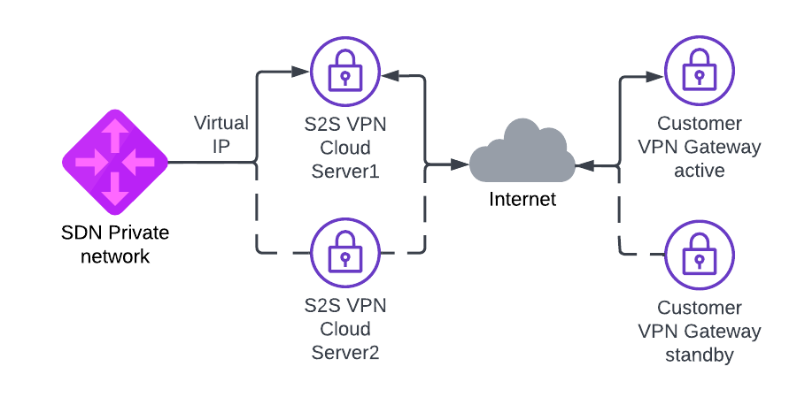

# Terraform HA Site-to-Site VPN demo

Please note that this is just an example on how you can use Terraform with [UpCloud](https://upcloud.com/) and 
should not be used in production as is. Please see [LICENSE](LICENSE) for details.



## Usage

Demo uses [StrongSwan](https://www.strongswan.org/) to create IPSEC Site-to-Site VPN on top of UpCloud. 
In this demo we create two different S2S VPN UpCloud cloud servers to create two Site-to-Site tunnels to two different remote VPN gateways. 
Keepalived (VRRP) is used to create virtual IP that moves automatically between VPN cloud servers when ipsec tunnel goes down. 
Cloud servers on UpCloud side need static route to remote network via this virtual IP. 

### Prerequisites

Project uses [Terraform](https://www.terraform.io/) and it needs to be installed. We're also using UpCloud's 
Terraform provider, but it should be automatically installed by running `terraform init` or with `make init`.

To create the resources with Terraform, you'll need your API credentials exported.

```
export UPCLOUD_USERNAME=your_username
export UPCLOUD_PASSWORD=your_password
```

You must also create `config.tfvars` file with your own settings:
 
```
remote_ip1 = "192.0.2.1" # First remote Site-to-Site VPN endpoint
remote_ip2 = "192.0.2.255" # Second remote Site-to-Site VPN endpoint
remote_network = "10.0.0.0/24,10.1.0.0/24,10.2.0.0/24" # Subnetwork or list of subnetworks separated by comma located on the remote side of VPN tunnel
upcloud_network = "10.255.0.0/24" # Subnetwork for UpCloud side SDN private network 
virtual_ip = "10.255.0.254" # IP address (other than first IP) from upcloud_network to be used for VIP between VPN cloud servers.
ipsec_psk = "Y0urPr35h4r3dK3y" # Pre-shared key 
zone = "pl-waw1"
server_plan = "1xCPU-1GB"
ssh_key_public = "ssh-rsa AAAA_YOUR_SSH_PUBLIC_KEY"
```
You should change the VRRP password (auth_pass) in `configs/keepalived.conf.tftpl` and depending on remote VPN service setting you might need to change settings in `configs/ipsec.conf.tftpl`.

### Quickstart

**IMPORTANT: Make sure your SSH-agent is running (execute this if not: `eval$(ssh-agent) && ssh-add <path_to_private_key> && ssh-add -L`), so Terraform scripts can SSH into VMs using agent forwarding**


### Creating services with basic configuration

Initate the project and install providers.

```
make init
```

Demo can now be created with Terraform. Creation takes around 10 minutes.

```
make create
```

### Testing stuff

You should log in to VPN server and check if Site-to-Site VPN is up. 

```
bash# ipsec status
Security Associations (1 up, 0 connecting):
upcloud-to-remote-tunnel[2]: ESTABLISHED 2 minutes ago, 5.22.218.1[5.22.218.1]...5.22.220.218[5.22.220.218]
upcloud-to-remote-tunnel{2}:  INSTALLED, TUNNEL, reqid 2, ESP SPIs: ce7f4596_i c812cd30_o
upcloud-to-remote-tunnel{2}:   10.200.0.0/24 === 10.255.0.0/24

bash# systemctl status keepalived
● keepalived.service - Keepalive Daemon (LVS and VRRP)
     Loaded: loaded (/lib/systemd/system/keepalived.service; enabled; vendor preset: enabled)
     Active: active (running) since Wed 2022-06-01 06:27:10 UTC; 1min 50s ago
   Main PID: 3170 (keepalived)
      Tasks: 2 (limit: 1012)
     Memory: 2.4M
     CGroup: /system.slice/keepalived.service
             ├─3170 /usr/sbin/keepalived --dont-fork
             └─3171 /usr/sbin/keepalived --dont-fork

Jun 01 06:27:10 s2s-vpn-vm1-pl-waw1 Keepalived_vrrp[3171]: (VI_1) Entering BACKUP STATE (init)
Jun 01 06:27:10 s2s-vpn-vm1-pl-waw1 Keepalived_vrrp[3171]: Script `ipsec_status` now returning 1
Jun 01 06:27:10 s2s-vpn-vm1-pl-waw1 Keepalived_vrrp[3171]: VRRP_Script(ipsec_status) failed (exited with status 1)
Jun 01 06:28:33 s2s-vpn-vm1-pl-waw1 Keepalived_vrrp[3171]: Script `ipsec_status` now returning 0
Jun 01 06:28:34 s2s-vpn-vm1-pl-waw1 Keepalived_vrrp[3171]: VRRP_Script(ipsec_status) succeeded
Jun 01 06:28:34 s2s-vpn-vm1-pl-waw1 Keepalived_vrrp[3171]: (VI_1) Changing effective priority from 101 to 111
Jun 01 06:28:35 s2s-vpn-vm1-pl-waw1 Keepalived_vrrp[3171]: (VI_1) received lower priority (101) advert from 10.255.0.2 - discarding
Jun 01 06:28:36 s2s-vpn-vm1-pl-waw1 Keepalived_vrrp[3171]: (VI_1) received lower priority (101) advert from 10.255.0.2 - discarding
Jun 01 06:28:37 s2s-vpn-vm1-pl-waw1 Keepalived_vrrp[3171]: (VI_1) received lower priority (101) advert from 10.255.0.2 - discarding
Jun 01 06:28:37 s2s-vpn-vm1-pl-waw1 Keepalived_vrrp[3171]: (VI_1) Entering MASTER STATE
```
You can test failover by shutting down active VPN VM.

### Destroying stuff

After testing things around its good to free the resources. Tearing the thing down is also just one command.

```
make destroy
```
